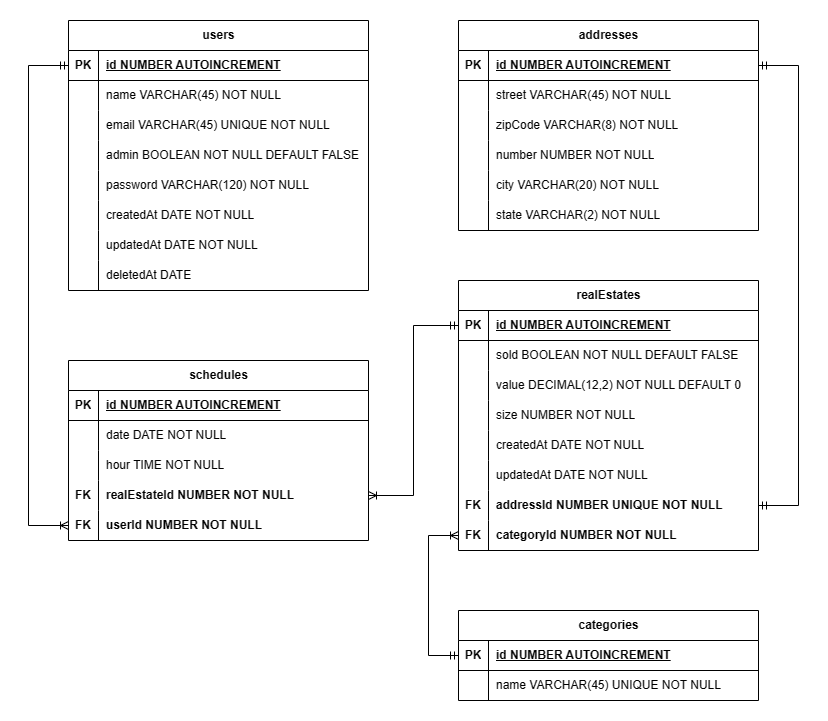

<h1 align="center">
  Imóveis - API
</h1>

<h3 align="center">
  A URL base da api é: https://api-imoveis.onrender.com
</h3>

## Visão Geral


Essa aplicação é um MVP de uma API REST, desenvolvida com o objetivo de facilitar o gerenciamento de serviços imobiliários; através dela é possível realizar o cadastro de imóveis e de usuários interessados na aquisição de propriedades. Além disso, também possível realizar o agendamento e consultar horários de visitas às propriedades disponíveis no banco de dados da imobiliária.

A aplicação possui ampla cobertura com testes unitários e end-to-end realizados com Jest & Supertest, que são realizados a cada push no repositório, por meio da CI do Github Actions, para garantir que a aplicação esteja em conformidade com os requisitos de segurança e de negócios que foram previamente estabelecidos.


## :hammer: Funcionalidades do projeto:
- CRUD de usuários
- Tokenização, autenticação e proteção de rotas
- Serialização de dados
- Agendamento de visitas de acordo com os horários e regras de negócio previamente estabelecidas
- Criação de empreendimentos
- Criação de categorias de empreendimentos
- Criação de endereços para os empreendimentos

## Tecnologias utilizadas:
- Node.js
- Express
- Typescript
- PostgreSQL
- TypeORM
- Zod
- Dotenv
- Bcryptjs
- Jsonwebtoken
- Jest e supertest


### Tabelas do banco de dados

<div align="center">
  
</div>


### Endpoints:

A API tem um total de 12 endpoints


| Método | Endpoint                   | Responsabilidade                                  | Autenticação                           |
| ------ | -------------------------- | ------------------------------------------------- | -------------------------------------- |
| POST   | /users                     | Criação de usuário                                | Qualquer usuário, não necessita token  |
| GET    | /users                     | Lista todos os usuários                           | Apenas Admnistradores                  |
| PATCH  | /users/:id                 | Atualiza um usuário                               | Apenas Admnistradores ou dono da conta |
| DELETE | /users/:id                 | Realiza um soft delete no usuário                 | Apenas Admnistradores                  |
| POST   | /login                     | Gera o token de autenticação                      | Qualquer usuário, não necessita token  |
| POST   | /categories                | Criação de categoria                              | Apenas Admnistradores                  |
| GET    | /categories                | Lista todas as categorias                         | Qualquer usuário, não necessita token  |
| GET    | /categories/:id/realEstate | Lista todos imóveis que pertencem a uma categoria | Qualquer usuário, não necessita token  |
| POST   | /realEstate                | Criação de um imóvel                              | Apenas Admnistradores                  |
| GET    | /realEstate                | Lista todos os imóveis                            | Qualquer usuário, não necessita token  |
| POST   | /schedules                 | Agenda uma visita a um imóvel                     | Qualquer usuário, obrigatório token    |
| GET    | /schedules/realEstate/:id  | lista todos os agendamentos de um imóvel          | Apenas Admnistradores                  |


#

<h3 align ='center'> USUÁRIO </h3>

### POST - /users


- Rota responsável pela criação de usuário com os seguintes dados:
  - **name**: string, máximo de 45 caracteres e obrigatório.
  - **email**: string, máximo de 45 caracteres, obrigatório e único. Onde não pode ser cadastrados dois usuários com o mesmo **e-mail**.
  - **password**: string, mínimo 4 caracteres, máximo de 120 caracteres e obrigatório. Receberá uma string mas armazenará uma hash gerada com o **bcryptjs diretamente pela entidade do TypeORM**.
  - **admin**: boolean, obrigatório e false por padrão.


##### CORPO DA REQUISIÇÃO:


```json
{
    "name": "Jhon Doe",
    "email": "jhondoe@mail.com.br",
    "password": "1234"
}
```

##### FORMATO DA RESPOSTA


###### USUÁRIO CRIADO COM SUCESSO: STATUS 201

```json
{
    "id": 1,
    "name": "Jhon Doe",
    "email": "jhondoe@mail.com.br",
    "admin": false,
    "createdAt": "2023-08-29",
    "updatedAt": "2023-08-29",
    "deletedAt": null
}
```

###### E-MAIL JÁ CADASTRADO: STATUS 409

```json
{
    "message": "Email already exists"
}
```


#

### GET - /users

- Rota responsável por listar todos os usuários.
- A rota pode ser acessada apenas por usuários **administradores**.

##### FORMATO DA RESPOSTA 

###### LISTAGEM COM SUCESSO: STATUS 200

```json
[
    {
        "id": 1,
        "name": "Jhon Doe",
        "email": "jhondoe@mail.com.br",
        "admin": true,
        "createdAt": "2023-08-29",
        "updatedAt": "2023-08-29",
        "deletedAt": null
    },
    {
        "id": 2,
        "name": "Jhon",
        "email": "jhon@mail.com.br",
        "admin": false,
        "createdAt": "2023-08-29",
        "updatedAt": "2023-08-29",
        "deletedAt": null
    },
    {
        "id": 3,
        "name": "Doe",
        "email": "doe@mail.com.br",
        "admin": false,
        "createdAt": "2023-09-01",
        "updatedAt": "2023-09-01",
        "deletedAt": null
    }
]
```

##### REQUISIÇÃO SEM O TOKEN: STATUS 401

```json
{
    "message": "jwt must be provided"
}
```

##### REQUISIÇÃO COM O TOKEN, MAS SEM SER DE ADMIN: STATUS 403

```json
{
    "message": "Insufficient permission"
}
```


#

### PATCH - /users/:id

- Rota responsável por atualizar os dados do usuário.
- Só é possível atualizar o **name**, **email** e **password**.
- Apenas administradores podem atualizar qualquer usuário, usuários não-administradores podem apenas atualizar seu próprio usuário.


#### FORMATO DA RESPOSTA


##### ATUALIZAÇÃO REALIZADA COM SUCESSO: STATUS 200

```json
// Rota /users/1 - CORPO DA REQUISIÇÃO:
{
    "name": "JhonDoe",
    "email": "jhondoe@gmail.com",
    "password": "123456"
}

{
    "id": 1,
    "name": "JhonDoe",
    "email": "jhondoe@gmail.com",
    "admin": false,
    "createdAt": "2023-08-29",
    "updatedAt": "2023-08-29",
    "deletedAt": null
}
```

##### REQUISIÇÃO SEM O TOKEN: STATUS 401

```json
{
    "message": "jwt must be provided"
}
```

##### REQUISIÇÃO COM O TOKEN, MAS SEM SER DE ADMIN: STATUS 403

```json
{
    "message": "Insufficient permission"
}
```

##### REQUISIÇÃO COM O TOKEN SEM SER DE ADMIN E TENTANDO ATUALIZAR UM OUTRO USUÁRIO: STATUS 403

```json
{
    "message": "Insufficient permission"
}
```

##### E-MAIL JÁ CADASTRADO: STATUS 409

```json
{
    "message": "Email already exists"
}
```

##### CASO O USUÁRIO NÃO EXISTA: STATUS 404

```json
{
	"message": "User not found"
}
```


#

### DELETE - /users/:id

- Rota responsável por realizar um soft delete do usuário.
- A rota pode ser acessada apenas por administradores.
- Não é possível realizar um soft delete em um usuário já deletado.


#### FORMATO DA RESPOSTA

##### USUÁRIO DELETADO COM SUCESSO: STATUS 204 - NO BODY

##### REQUISIÇÃO SEM O TOKEN: STATUS 401

```json
{
  "message": "jwt must be provided"
}
```

##### REQUISIÇÃO COM O TOKEN, MAS SEM SER DE ADMIN: STATUS 403

```json
{
  "message": "Insufficient permission"
}
```

##### USUÁRIO INEXISTENTE: STATUS 404

```json
{
	"message": "User not found"
}
```


#

<h3 align ='center'> LOGIN </h3>

### POST - /login

- Rota de login recebendo **email** e **password**.


#### CORPO DA REQUISIÇÃO:


```json
{
  "email": "jhondoe@gmail.com",
  "password": "123456"
}
```


#### FORMATO DA RESPOSTA


##### TOKEN GERADO COM SUCESSO: STATUS 200

```json
{
  "token": "eyJhbGciOiJIUzI1NiIsInR5cC..."
}
```

##### REQUISIÇÃO COM EMAIL/SENHA INVÁLIDO(A): STATUS 401

```json
{
	"message": "Invalid credentials"
}
```

#

<h3 align ='center'> CATEGORIAS </h3>

### POST - /categories


- Rota responsável pela criação de uma categoria, recebendo os seguintes dados:
  - **name**: string, máximo de 45 caracteres e obrigatório.

- Não é possível criar uma categoria com o nome em duplicidade.
- A rota pode ser acessada apenas por usuários administradores.


#### CORPO DA REQUISIÇÃO:


```json
{
  "name": "Categoria A"
}
```


#### FORMATO DA RESPOSTA


##### CATEGORIA CRIADA COM SUCESSO: STATUS 201

```json
{
  "id": 1,
  "name": "Categoria A",
}
```

##### REQUISIÇÃO SEM O TOKEN: STATUS 401

```json
{
  "message": "jwt must be provided"
}
```

##### REQUISIÇÃO COM O TOKEN, MAS SEM SER DE ADMIN: STATUS 403

```json
{
  "message": "Insufficient permission"
}
```

##### CATEGORIA JÁ EXISTENTE: STATUS 409

```json
{
  "message": "Category already exists"
}
```

#

### GET - /categories

- Rota responsável por listar todas as categorias.
- A rota não precisa de autenticação para ser acessada.


#### FORMATO DA RESPOSTA


##### LISTAGEM COM SUCESSO: STATUS 200

```json
[
	{
		"id": 1,
		"name": "Categoria A"
	},
	{
		"id": 2,
		"name": "Categoria B"
	},
	{
		"id": 3,
		"name": "Categoria C"
	}
]
```

#

### GET - /categories/:id/realEstate

- Rota responsável por listar todos os imóveis que pertencem a uma categoria.
- A rota não precisa de autenticação para ser acessada.


#### FORMATO DA RESPOSTA


##### LISTAGEM COM SUCESSO: STATUS 200

```json
{
	"id": 1,
	"name": "Categoria A",
	"realEstate": [
		{
			"id": 1,
			"sold": false,
			"value": "100000.99",
			"size": 400,
			"createdAt": "2023-08-30",
			"updatedAt": "2023-08-30"
		}
	]
}
```

##### CATEGORIA INEXISTENTE: STATUS 404

```json
{
  "message": "Category not found"
}
```

#

<h3 align ='center'> EMPREENDIMENTOS </h3>

### POST - /realEstate

- Rota responsável pela criação de um imóvel, recebendo os seguintes dados:
  - **value**: decimal, precisão 12 e escala 2, obrigatório e 0 por padrão.
  - **size**: número inteiro e obrigatório.
  - **categoryId**: number, inteiro e obrigatório.
  - **address**: um objeto com os seguintes dados:
    - **street**: string, máximo de 45 caracteres e obrigatório.
    - **zipCode**: string, máximo de 8 caracteres e obrigatório.
    - **number**: number, inteiro, positivo e obrigatório.
    - **city**: string, máximo de 20 caracteres e obrigatório.
    - **state**: string, máximo de 2 caracteres e obrigatório.

- Não podem ser cadastrados dois imóveis com o mesmo endereço.
- A rota pode ser acessada apenas por administradores.


#### CORPO DA REQUISIÇÃO:

```json
{
	"value": 100000.99,
	"size": 400,
	"address": {
		"street": "street",
		"zipCode": "zipCode",
		"number": 1,
		"city": "city",
		"state": "s0"
	},
	"categoryId": 1
}
```


#### FORMATO DA RESPOSTA


##### EMPREENDIMENTO CRIADO COM SUCESSO: STATUS 201

```json
{
	"value": "100000.99",
	"size": 400,
	"address": {
		"id": 2,
		"street": "Test",
		"zipCode": "zipCode",
		"number": 1,
		"city": "city",
		"state": "s0"
	},
	"category": {
		"id": 1,
		"name": "Categoria A"
	},
	"id": 2,
	"sold": false,
	"createdAt": "2023-09-01",
	"updatedAt": "2023-09-01"
}
```

##### REQUISIÇÃO SEM O TOKEN: STATUS 401

```json
{
  "message": "jwt must be provided"
}
```

##### REQUISIÇÃO COM O TOKEN, MAS SEM SER DE ADMIN: STATUS 403

```json
{
  "message": "Insufficient permission"
}
```

##### ENDEREÇO JÁ EXISTENTE: STATUS 409

```json
{
	"message": "Address already exists"
}
```

#

### GET - /realEstate

- Rota responsável por listar todos os imóveis.
- A rota não precisa de autenticação para ser acessada.


#### FORMATO DA RESPOSTA


##### LISTAGEM COM SUCESSO: STATUS 200

```json
[
	{
		"id": 1,
		"sold": false,
		"value": "100000.99",
		"size": 400,
		"createdAt": "2023-08-30",
		"updatedAt": "2023-08-30",
		"address": {
			"id": 1,
			"street": "street",
			"zipCode": "zipCode",
			"number": 1,
			"city": "city",
			"state": "s0"
		}
	},
	{
		"id": 2,
		"sold": false,
		"value": "100000.99",
		"size": 400,
		"createdAt": "2023-09-01",
		"updatedAt": "2023-09-01",
		"address": {
			"id": 2,
			"street": "Test",
			"zipCode": "zipCode",
			"number": 1,
			"city": "city",
			"state": "s0"
		}
	}
]
```

#

<h3 align ='center'> AGENDAMENTOS </h3>

### POST - /schedules

- Rota responsável pela criação de um agendamento/visita a um imóvel com os seguintes dados:
  - **date**: string da data de agendamento da visita ao imóvel, no formato americano **AAAA-MM-DD**.
  - **hour**: string do horário de agendamento da visita ao imóvel, no formato **HH:MM**.
  - **realEstateId**: number, inteiro e obrigatório.
  - **userId**: Não deve ser passado no body da requisição, ele é captado através do token do usuário.

- Não é possível agendar uma visita a um imóvel com a mesma data e hora.
- Não é possível o mesmo **usuário** agendar uma visita a 2 imóveis diferentes com a mesma data e hora.
- Só é possível agendar uma visita durante horário comercial (08:00 as 18:00).
- Só é possível agendar uma visita durante dias úteis (segunda à sexta).
- A rota pode ser acessada tanto por usuários comuns quanto administradores.


#### CORPO DA REQUISIÇÃO:


```json
{
	"date": "2022/03/01",
	"hour": "12:30",
	"realEstateId": 1
}
```


#### FORMATO DA RESPOSTA 


##### AGENDAMENTO CRIADO COM SUCESSO: STATUS 201

```json
{
	"message": "Schedule created"
}
```

##### REQUISIÇÃO SEM O TOKEN: STATUS 401

```json
{
  "message": "Missing bearer token"
}
```

##### DIA DA SEMANA INVÁLIDO: STATUS 400

```json
{
	"message": "Invalid date, work days are monday to friday"
}
```

##### HORÁRIO INVÁLIDO: STATUS 400

```json
{
	"message": "Invalid hour, available times are 8AM to 18PM"
}
```

##### JÁ EXISTE UM AGENDAMENTO COM O MESMO DIA & HORA PARA O EMPREENDIMENTO: STATUS 409

```json
{
	"message": "Schedule to this real estate at this date and time already exists"
}
```

##### O USUÁRIO JÁ TEM UM AGENDAMENTO COM O MESMO DIA & HORA: STATUS 409

```json
{
	"message": "User already has an schedule at this date and time"
}
```

#

### GET - /schedules/realEstate/:id

- Rota responsável por listar todos os agendamentos de um imóvel.
- A rota pode ser acessada apenas por administradores.


#### FORMATO DA RESPOSTA


##### LISTAGEM REALIZADA COM SUCESSO: STATUS 200

```json
{
	"id": 1,
	"sold": false,
	"value": "100000.99",
	"size": 400,
	"createdAt": "2023-08-30",
	"updatedAt": "2023-08-30",
	"address": {
		"id": 1,
		"street": "street",
		"zipCode": "zipCode",
		"number": 1,
		"city": "city",
		"state": "s0"
	},
	"category": {
		"id": 1,
		"name": "Categoria A"
	},
	"schedules": [
		{
			"id": 1,
			"date": "2022-03-01",
			"hour": "12:30:00",
			"user": {
				"id": 1,
				"name": "Maykel",
				"email": "fabio@kenzie.com.br",
				"admin": true,
				"createdAt": "2023-08-29",
				"updatedAt": "2023-09-01",
				"deletedAt": null
			}
		}
	]
}
```

##### REQUISIÇÃO SEM O TOKEN: STATUS 401

```json
{
  "message": "jwt must be provided"
}
```

##### REQUISIÇÃO COM O TOKEN, MAS SEM SER DE ADMIN: STATUS 403

```json
{
  "message": "Insufficient permission"
}
```

##### ID INEXISTENTE DO EMPREENDIMENTO: STATUS 404

```json
{
  "message": "RealEstate not found"
}
```